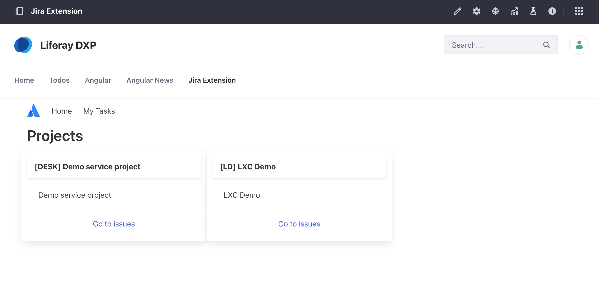
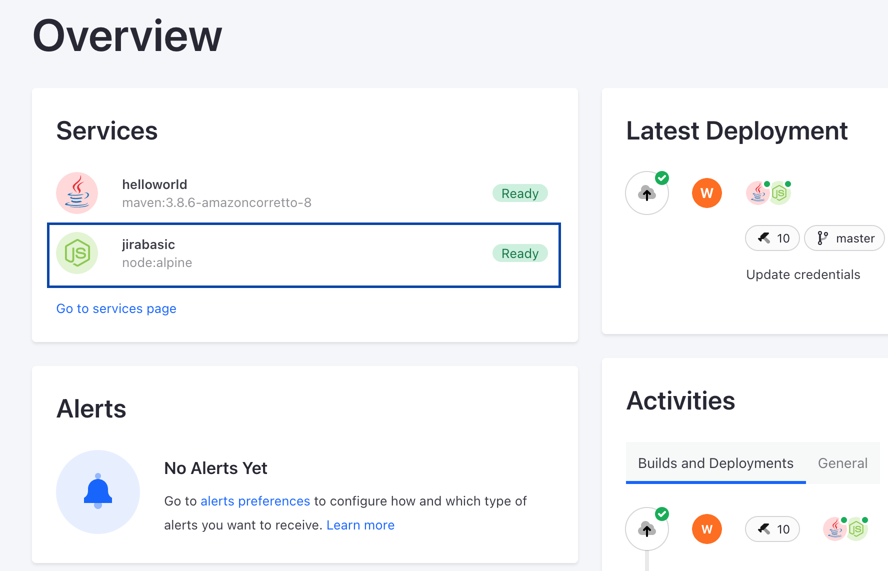

# LXC Extension Jira Viewer

LXC Client Extension with Jira integration using Next 13 and Jira API.

It is increasingly important for teams to explore the practical use of Client Extensions. This is a working version of a LXC Client Extension with Jira integration using Next 13 and the Jira API. This project can be used as a template to work from for Jira or intrating with similar service outcomes.

### How to use

1. Copy the file `.env.example` and rename it to `.env`
2. Add Jira Credentials to .env file.
3. AFAIK, set `JIRA_CLIENT_VERSION`**v3** if you are using *Jira Cloud*, otherwise use **v2** 

### Adding it to Liferay Portal

1. Go to application menu
2. Custom Apps > Client Extensions
3. Plus Sign > Add Iframe
    3.1 **Name:** Your choice
    3.2 **URL:** Copy the URL from dev-server or LXC domain
    3.3 Publish
4. Go to a page > edit > find the portlet created > drag it to the page

### Key Features
* Next 13
* Turbo
* React
